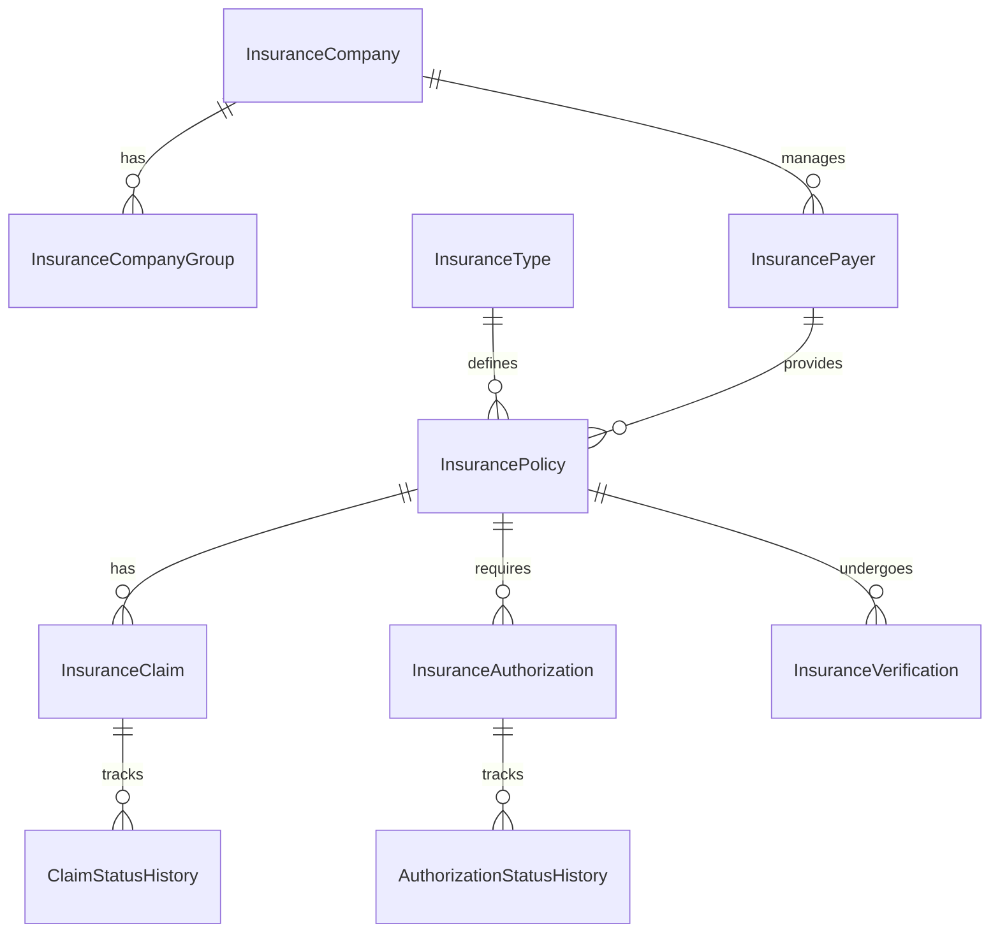

# Insurance Database Schema Documentation
Version: 2024-12-19_18-47

## Overview
The insurance database schema manages all insurance-related data including policies, claims, authorizations, and verifications.

## Schema Diagram


## Tables

### insurance_company
Stores information about insurance companies.

```sql
CREATE TABLE insurance_company (
    id SERIAL PRIMARY KEY,
    name VARCHAR(255) NOT NULL,
    code VARCHAR(50) NOT NULL UNIQUE,
    tax_id VARCHAR(20),
    npi VARCHAR(10),
    address JSONB,
    contact JSONB,
    is_active BOOLEAN DEFAULT true,
    created_at TIMESTAMP WITH TIME ZONE DEFAULT CURRENT_TIMESTAMP,
    updated_at TIMESTAMP WITH TIME ZONE DEFAULT CURRENT_TIMESTAMP,
    created_by VARCHAR(255) NOT NULL,
    updated_by VARCHAR(255) NOT NULL,
    deleted_at TIMESTAMP WITH TIME ZONE
);

CREATE INDEX idx_insurance_company_code ON insurance_company(code);
CREATE INDEX idx_insurance_company_active ON insurance_company(is_active) WHERE is_active = true;
```

### insurance_company_group
Manages hierarchical relationships between insurance companies.

```sql
CREATE TABLE insurance_company_group (
    id SERIAL PRIMARY KEY,
    name VARCHAR(255) NOT NULL,
    parent_group_id INTEGER REFERENCES insurance_company_group(id),
    company_id INTEGER NOT NULL REFERENCES insurance_company(id),
    is_active BOOLEAN DEFAULT true,
    created_at TIMESTAMP WITH TIME ZONE DEFAULT CURRENT_TIMESTAMP,
    updated_at TIMESTAMP WITH TIME ZONE DEFAULT CURRENT_TIMESTAMP,
    created_by VARCHAR(255) NOT NULL,
    updated_by VARCHAR(255) NOT NULL,
    deleted_at TIMESTAMP WITH TIME ZONE
);

CREATE INDEX idx_insurance_company_group_company ON insurance_company_group(company_id);
CREATE INDEX idx_insurance_company_group_parent ON insurance_company_group(parent_group_id);
```

### insurance_payer
Stores information about insurance payers.

```sql
CREATE TABLE insurance_payer (
    id SERIAL PRIMARY KEY,
    company_id INTEGER NOT NULL REFERENCES insurance_company(id),
    payer_id VARCHAR(50) NOT NULL UNIQUE,
    name VARCHAR(255) NOT NULL,
    payer_type VARCHAR(50) NOT NULL,
    is_active BOOLEAN DEFAULT true,
    created_at TIMESTAMP WITH TIME ZONE DEFAULT CURRENT_TIMESTAMP,
    updated_at TIMESTAMP WITH TIME ZONE DEFAULT CURRENT_TIMESTAMP,
    created_by VARCHAR(255) NOT NULL,
    updated_by VARCHAR(255) NOT NULL,
    deleted_at TIMESTAMP WITH TIME ZONE
);

CREATE INDEX idx_insurance_payer_company ON insurance_payer(company_id);
CREATE INDEX idx_insurance_payer_type ON insurance_payer(payer_type);
```

### insurance_type
Defines different types of insurance policies.

```sql
CREATE TABLE insurance_type (
    id SERIAL PRIMARY KEY,
    code VARCHAR(50) NOT NULL UNIQUE,
    name VARCHAR(255) NOT NULL,
    category VARCHAR(50) NOT NULL,
    description TEXT,
    is_active BOOLEAN DEFAULT true,
    created_at TIMESTAMP WITH TIME ZONE DEFAULT CURRENT_TIMESTAMP,
    updated_at TIMESTAMP WITH TIME ZONE DEFAULT CURRENT_TIMESTAMP,
    created_by VARCHAR(255) NOT NULL,
    updated_by VARCHAR(255) NOT NULL,
    deleted_at TIMESTAMP WITH TIME ZONE
);

CREATE INDEX idx_insurance_type_code ON insurance_type(code);
CREATE INDEX idx_insurance_type_category ON insurance_type(category);
```

### insurance_policy
Stores insurance policy information.

```sql
CREATE TABLE insurance_policy (
    id SERIAL PRIMARY KEY,
    policy_number VARCHAR(50) NOT NULL UNIQUE,
    payer_id INTEGER NOT NULL REFERENCES insurance_payer(id),
    type_id INTEGER NOT NULL REFERENCES insurance_type(id),
    patient_id INTEGER NOT NULL,
    start_date DATE NOT NULL,
    end_date DATE,
    status VARCHAR(20) NOT NULL DEFAULT 'ACTIVE',
    group_number VARCHAR(50),
    subscriber_id VARCHAR(50) NOT NULL,
    subscriber_name VARCHAR(255) NOT NULL,
    subscriber_relationship VARCHAR(20) NOT NULL,
    created_at TIMESTAMP WITH TIME ZONE DEFAULT CURRENT_TIMESTAMP,
    updated_at TIMESTAMP WITH TIME ZONE DEFAULT CURRENT_TIMESTAMP,
    created_by VARCHAR(255) NOT NULL,
    updated_by VARCHAR(255) NOT NULL,
    deleted_at TIMESTAMP WITH TIME ZONE,
    CONSTRAINT valid_dates CHECK (end_date IS NULL OR end_date >= start_date)
);

CREATE INDEX idx_insurance_policy_patient ON insurance_policy(patient_id);
CREATE INDEX idx_insurance_policy_dates ON insurance_policy(start_date, end_date);
CREATE INDEX idx_insurance_policy_status ON insurance_policy(status);
```

### insurance_claim
Manages insurance claims.

```sql
CREATE TABLE insurance_claim (
    id SERIAL PRIMARY KEY,
    claim_number VARCHAR(50) NOT NULL UNIQUE,
    policy_id INTEGER NOT NULL REFERENCES insurance_policy(id),
    service_date DATE NOT NULL,
    diagnosis_codes TEXT[] NOT NULL,
    service_lines JSONB NOT NULL,
    total_charge DECIMAL(10,2) NOT NULL,
    status VARCHAR(20) NOT NULL DEFAULT 'SUBMITTED',
    external_claim_id VARCHAR(50),
    created_at TIMESTAMP WITH TIME ZONE DEFAULT CURRENT_TIMESTAMP,
    updated_at TIMESTAMP WITH TIME ZONE DEFAULT CURRENT_TIMESTAMP,
    created_by VARCHAR(255) NOT NULL,
    updated_by VARCHAR(255) NOT NULL,
    deleted_at TIMESTAMP WITH TIME ZONE
);

CREATE INDEX idx_insurance_claim_policy ON insurance_claim(policy_id);
CREATE INDEX idx_insurance_claim_date ON insurance_claim(service_date);
CREATE INDEX idx_insurance_claim_status ON insurance_claim(status);
```

### claim_status_history
Tracks claim status changes.

```sql
CREATE TABLE claim_status_history (
    id SERIAL PRIMARY KEY,
    claim_id INTEGER NOT NULL REFERENCES insurance_claim(id),
    status VARCHAR(20) NOT NULL,
    notes TEXT,
    created_at TIMESTAMP WITH TIME ZONE DEFAULT CURRENT_TIMESTAMP,
    created_by VARCHAR(255) NOT NULL
);

CREATE INDEX idx_claim_status_history_claim ON claim_status_history(claim_id);
```

### insurance_authorization
Manages prior authorizations.

```sql
CREATE TABLE insurance_authorization (
    id SERIAL PRIMARY KEY,
    authorization_number VARCHAR(50) NOT NULL UNIQUE,
    policy_id INTEGER NOT NULL REFERENCES insurance_policy(id),
    service_type VARCHAR(50) NOT NULL,
    start_date DATE NOT NULL,
    end_date DATE NOT NULL,
    diagnosis_codes TEXT[] NOT NULL,
    procedure_codes TEXT[] NOT NULL,
    status VARCHAR(20) NOT NULL DEFAULT 'PENDING',
    external_auth_id VARCHAR(50),
    created_at TIMESTAMP WITH TIME ZONE DEFAULT CURRENT_TIMESTAMP,
    updated_at TIMESTAMP WITH TIME ZONE DEFAULT CURRENT_TIMESTAMP,
    created_by VARCHAR(255) NOT NULL,
    updated_by VARCHAR(255) NOT NULL,
    deleted_at TIMESTAMP WITH TIME ZONE,
    CONSTRAINT valid_dates CHECK (end_date >= start_date)
);

CREATE INDEX idx_insurance_authorization_policy ON insurance_authorization(policy_id);
CREATE INDEX idx_insurance_authorization_dates ON insurance_authorization(start_date, end_date);
CREATE INDEX idx_insurance_authorization_status ON insurance_authorization(status);
```

### authorization_status_history
Tracks authorization status changes.

```sql
CREATE TABLE authorization_status_history (
    id SERIAL PRIMARY KEY,
    authorization_id INTEGER NOT NULL REFERENCES insurance_authorization(id),
    status VARCHAR(20) NOT NULL,
    notes TEXT,
    created_at TIMESTAMP WITH TIME ZONE DEFAULT CURRENT_TIMESTAMP,
    created_by VARCHAR(255) NOT NULL
);

CREATE INDEX idx_authorization_status_history_auth ON authorization_status_history(authorization_id);
```

### insurance_verification
Stores insurance verification results.

```sql
CREATE TABLE insurance_verification (
    id SERIAL PRIMARY KEY,
    policy_id INTEGER NOT NULL REFERENCES insurance_policy(id),
    verification_type VARCHAR(20) NOT NULL,
    service_types TEXT[] NOT NULL,
    verification_date TIMESTAMP WITH TIME ZONE NOT NULL,
    policy_verification JSONB NOT NULL,
    benefits_verification JSONB,
    created_at TIMESTAMP WITH TIME ZONE DEFAULT CURRENT_TIMESTAMP,
    updated_at TIMESTAMP WITH TIME ZONE DEFAULT CURRENT_TIMESTAMP,
    created_by VARCHAR(255) NOT NULL,
    updated_by VARCHAR(255) NOT NULL
);

CREATE INDEX idx_insurance_verification_policy ON insurance_verification(policy_id);
CREATE INDEX idx_insurance_verification_date ON insurance_verification(verification_date);
```

## Common Fields

### Audit Fields
All tables include standard audit fields:
- `created_at`: Timestamp of record creation
- `updated_at`: Timestamp of last update
- `created_by`: User who created the record
- `updated_by`: User who last updated the record
- `deleted_at`: Soft deletion timestamp (where applicable)

### Status Fields
Status fields use predefined values:
- Policy Status: `ACTIVE`, `INACTIVE`, `EXPIRED`, `CANCELLED`
- Claim Status: `SUBMITTED`, `IN_PROCESS`, `ADJUDICATED`, `FINALIZED`, `REJECTED`
- Authorization Status: `PENDING`, `APPROVED`, `DENIED`, `CANCELLED`

## Indexes
Key indexes are created for:
1. Primary keys (automatically created)
2. Foreign key relationships
3. Frequently queried fields
4. Status fields
5. Date ranges

## JSON Fields
JSONB fields are used for flexible data:
1. `address`: Structured address information
2. `contact`: Contact details
3. `service_lines`: Claim service line details
4. `policy_verification`: Verification results
5. `benefits_verification`: Benefit details

## Constraints
Important constraints include:
1. Unique constraints on business identifiers
2. Date range validations
3. Foreign key relationships
4. Status value restrictions
5. Required fields

## Performance Considerations
1. Appropriate index selection
2. Partitioning for large tables
3. Regular maintenance
4. Query optimization
5. Data archival strategy

## Security
1. Row-level security policies
2. Audit logging
3. Data encryption
4. Access control
5. Backup strategy
