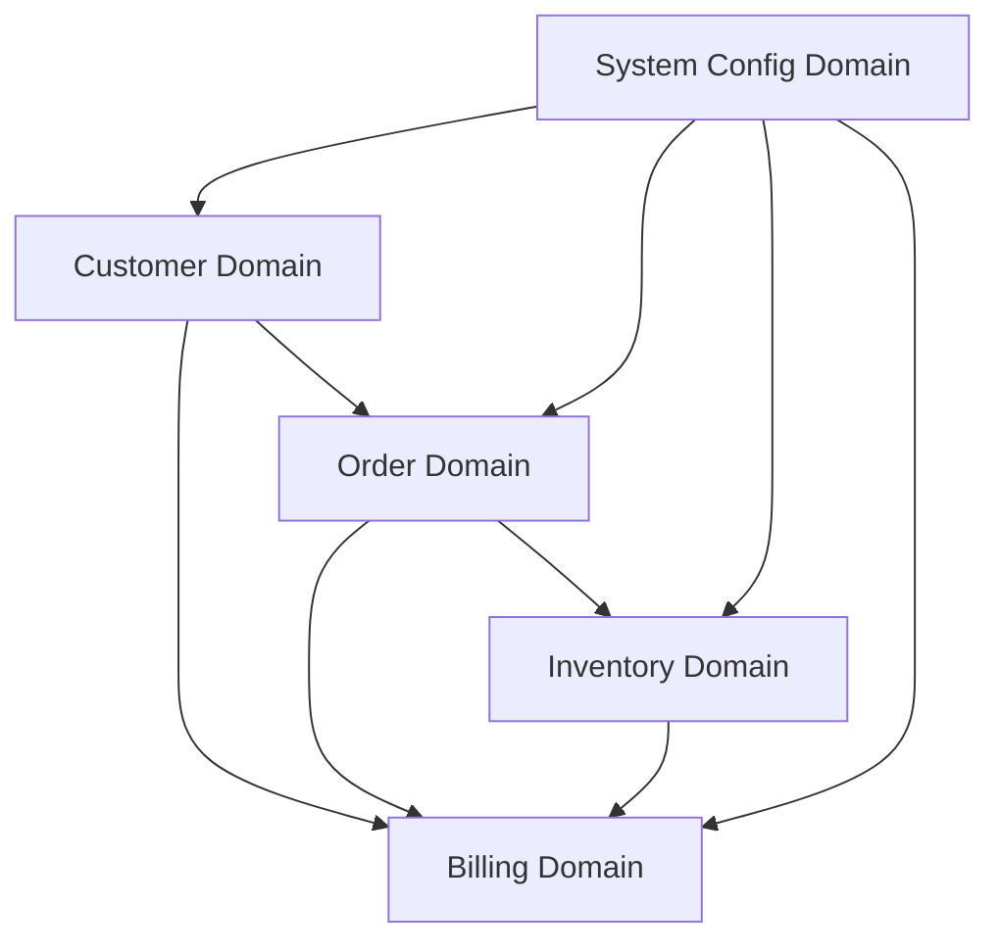

# Database Domain Analysis
Version: 2024-12-14_17-40

## Overview
This document provides a comprehensive analysis of the database domains and their relationships in the Aries Enterprise system, following our established guiding principles.

## 1. Domain Mapping

### 1.1 Customer Management Domain
Primary Schema: `c01`
#### Core Tables
- `tbl_customer` (Primary entity)
- `tbl_customer_address`
- `tbl_customer_contact`
- `tbl_customer_insurance`
- `tbl_customer_documents`
#### Supporting Tables
- `tbl_insurance_company`
- `tbl_insurance_policy`
- `tbl_facility`
- `tbl_doctor`
#### Relationships
- Customer → Insurance Policies (1:N)
- Customer → Facilities (N:M)
- Customer → Doctors (N:M)

### 1.2 Order Processing Domain
Primary Schema: `c01`
#### Core Tables
- `tbl_order` (Primary entity)
- `tbl_orderdetails`
- `tbl_order_status`
- `tbl_order_tracking`
#### Supporting Tables
- `tbl_shipping_method`
- `tbl_delivery_schedule`
- `tbl_authorization`
#### Relationships
- Order → Customer (N:1)
- Order → OrderDetails (1:N)
- Order → Inventory (N:M)

### 1.3 Inventory Management Domain
Primary Schema: `dmeworks`
#### Core Tables
- `tbl_inventoryitem` (Primary entity)
- `tbl_inventory_location`
- `tbl_inventory_transaction`
- `tbl_warehouse`
#### Supporting Tables
- `tbl_item_category`
- `tbl_supplier`
- `tbl_maintenance_schedule`
#### Relationships
- Inventory → Warehouse (N:1)
- Inventory → Supplier (N:M)
- Inventory → Orders (N:M)

### 1.4 Billing & Insurance Domain
Primary Schema: `c01`
#### Core Tables
- `tbl_invoice` (Primary entity)
- `tbl_invoice_details`
- `tbl_payment`
- `tbl_insurance_claim`
#### Supporting Tables
- `tbl_billing_code`
- `tbl_price_code`
- `tbl_payment_type`
#### Relationships
- Invoice → Order (N:1)
- Invoice → Insurance Claims (1:N)
- Invoice → Payments (1:N)

### 1.5 System Configuration Domain
Primary Schema: `repository`
#### Core Tables
- `tbl_company` (Primary entity)
- `tbl_user`
- `tbl_role`
- `tbl_permission`
#### Supporting Tables
- `tbl_system_config`
- `tbl_audit_log`
- `tbl_batch_process`
#### Relationships
- User → Roles (N:M)
- Role → Permissions (N:M)
- Company → Configuration (1:N)

## 2. Dependency Graph



## 3. Implementation Priority

### Phase 1: Foundation (Weeks 1-2)
1. System Configuration Domain
   - Core configuration tables
   - User management
   - Authentication/Authorization

### Phase 2: Core Business (Weeks 3-4)
1. Customer Management Domain
   - Customer profiles
   - Insurance information
   - Medical providers

### Phase 3: Operations (Weeks 4-5)
1. Order Processing Domain
2. Inventory Management Domain
   - Implement in parallel
   - Focus on relationships

### Phase 4: Financial (Week 6)
1. Billing & Insurance Domain
   - Complex calculations
   - Insurance rules
   - Payment processing

## 4. Technical Implementation

### 4.1 Base Model Structure
```python
from sqlalchemy import Column, ForeignKey, String
from sqlalchemy.orm import relationship
from app.core.database import Base

class BaseModel(Base):
    """Base model with common fields"""
    __abstract__ = True
    
    created_at = Column(DateTime, default=datetime.utcnow)
    updated_at = Column(DateTime, default=datetime.utcnow, onupdate=datetime.utcnow)
    created_by = Column(String)
    updated_by = Column(String)
```

### 4.2 Domain Model Example
```python
class Customer(BaseModel):
    """Customer domain primary entity"""
    __tablename__ = "customers"
    
    id = Column(Integer, primary_key=True)
    first_name = Column(String(50), nullable=False)
    last_name = Column(String(50), nullable=False)
    date_of_birth = Column(Date, nullable=False)
    
    # Relationships
    addresses = relationship("CustomerAddress", back_populates="customer")
    insurance_policies = relationship("CustomerInsurance", back_populates="customer")
    orders = relationship("Order", back_populates="customer")
    
    # Validation
    @validates("date_of_birth")
    def validate_birth_date(self, key, value):
        if value > date.today():
            raise ValueError("Birth date cannot be in the future")
        return value
```

## 5. Next Steps

1. Set up base infrastructure
   - SQLAlchemy async engine
   - Alembic migrations
   - Base model classes

2. Implement System Configuration domain
   - User management
   - Role-based access control
   - Audit logging

3. Begin Customer domain implementation
   - Core customer models
   - Insurance integration
   - Provider management

## 6. Cross-References

- Implementation Risks Analysis: [../01_Planning/implementation_risks_analysis.md]
- Migration Strategy: [./migration_strategy.md]
- Technical Architecture: [../03_Design/technical_architecture.md]

## Change History

- 2024-12-14_17-40: Initial domain analysis document created
